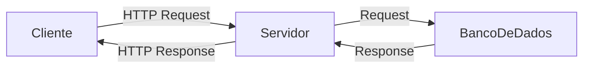

<p align="center">
  
</p>

# 📝Desafio 01

Desafio proposto ao fim da primeira Sprint do **Programa de Bolsas de NodeJS da [Compass.uol](https://compass.uol/)**.

## Cursos concluídos

 - [Scrum: agilidade em seu projeto](https://cursos.alura.com.br/course/agile-scrum)
 - [Git e Github: controle e compartilhe seu código](https://www.alura.com.br/curso-online-git-github-controle-de-versao)
 - [HTTP: Entendendo a web por baixo dos panos](https://cursos.alura.com.br/course/http-fundamentos)

## Artigos lidos

 - [O que é o scrum?](https://www.atlassian.com/br/agile/scrum)
 - [Padrão de commit](https://www.conventionalcommits.org/pt-br/v1.0.0/)
 - [Git - guia prático](https://rogerdudler.github.io/git-guide/index.pt_BR.html)
 - [Fluxo de trabalho de Gitflow](https://www.atlassian.com/br/git/tutorials/comparing-workflows/gitflow-workflow)
 - [Códigos de status de respostas HTTP](https://developer.mozilla.org/pt-BR/docs/Web/HTTP/Status)

## Desafios

### 1. Para que serve o método Scrum? 
O método Scrum tem como objetivo auxiliar as pessoas envolvidas a ``resolver problemas complexos``, permitindo a entrega de produtos de maneira ``ágil`` e com ``qualidade``. Ele se diferencia dos outros métodos principalmente por possuir um ciclo de desenvolvimento estritamente definido.
***

### 2. Como funciona o método Scrum? 

#### O Scrum possui 3 pilares:

<pre>
• <strong>Transparência</strong> → dos processos, requisitos e status.
• <strong>Inspeção</strong> → constante do que está sendo feito.
• <strong>Adaptação</strong> → tanto do processo, quanto do produto às mudanças.
</pre>

#### Os envolvidos
Ele prevê que uma equipe deve ser dividida em 3 partes: Product Owner, Scrum Master e os Desenvolvedores.

<div>
  <details>
  <summary>📝 <strong>Product Owner</strong></summary>
  <pre>
  • Líder do projeto;
  • Define quais recursos e funcionalidades serão feitos e em qual ordem;
  • Responsável por manter e comunicar o que a equipe busca alcançar;
  • Prioriza os items do Product Backlog.</pre>
  </details>
  
  <details>
  <summary>💾 <strong>Scrum Master</strong></summary>
  <pre>
  • Responsável por ajudar os envolvidos a entender os valores, princípios e práticas do Scrum;
  • Deve conhecer muito bem o Scrum;
  • Coach na liderança do processo;
  • Ajuda a equipe a desenvolver a sua própria abordagem do Scrum;</pre>
  </details>

  <details>
  <summary>👨🏻‍💻 <strong>Desenvolvedores</strong></summary>
  <pre>
  • Quem vai construir o projeto;
  • Decidem como fazer as coisas;
  • Devem se organizar da melhor maneira para realizar o projeto do Product Owner.</pre>
  </details>
</div>

#### Etapas do processo

<kbd>
  
</kbd>

###

Analisando a imagem acima, podemos destacar algumas coisas:

<details>
  <summary>📄 <strong>Product Backlog</strong></summary>
  <pre>
  • É escrito pelo Product Owner;
  • Contém todas as funcionalidades do software;
  • O P.O prioriza as funcionalidades com base no valor que elas agregam.</pre>
</details>

<details>
  <summary>🤔 <strong>Sprint Planning</strong></summary>
  <pre>
  • Reunião de planejamento da sprint;
  • O P.O explica aos Devs as funcionalidades que estão no topo do P.B e então eles 
    avaliam e negociam o que poderá ser concluído na Sprint.</pre>
</details>

<details>
  <summary>📑 <strong>Sprint Backlog</strong></summary>
  <pre>
  • Contém as funcionalidades que deverão ser feitas durante a Sprint atual.</pre>
</details>

<details>
  <summary>🏁 <strong>Sprint</strong></summary>
  <pre>
  • Período de tempo para desenvolver as funcionalidades da Sprint Backlog;
  • Possui uma duração(time-box) estritamente definida;
  • Geralmente de 2 a 4 semanas de duração.</pre>
</details>

<details>
  <summary>☀ <strong>Daily Meeting</strong></summary>
  <pre>
  • Reunião diária realizada no mesmo horário e local;
  • Possui uma duração específica de 15 min, e não mais que isso;
  • Tem como objetivo promover a melhoria contínua;
  • Mantém a equipe atualizada com o andamento do projeto;</pre>
</details>

<details>
  <summary>🔍 <strong>Sprint Review</strong></summary>
  <pre>
  • Validar e Adaptar o produto que está sendo construído;
  • Apresentação do que foi feito no Sprint;
  • Todos os envolvidos no projeto participam, além do(s) cliente(s)e usuário(s).</pre>
</details>

<details>
  <summary>🗃 <strong>Sprint Retrospective</strong></summary>
  <pre>
  • A retrospectiva é o momento de melhoria contínua, é quando levantamos pontos positivos e negativos;
  • Para os pontos negativos, devem-se propor ações com o objetivo de resolver estes problemas;
  • Uma boa prática que pode ajudar na Sprint Retrospective é a utilização de post-it's. Para isso, são entregues
    post-it's iguais a todos os envolvidos na reunião, e um ponto é escrito por folha. Após isso, todos são colados
    em uma lousa, e agrupados por assunto. A partir disso, o processo de discussão começa.</pre>

  Ao início de cada reunião, muitos gostam de citar o seguinte trecho do texto de Norm Kerth, 'Retrospective Prime Directive':
  
  > Independentemente do que descubramos, nós entendemos e realmente acreditamos que todos fizeram o melhor trabalho que podiam, dado o conhecimento na época, suas habilidades, os recursos disponíveis e a situação em jogo.
</details>

***
### 3. O que é Git? 
#### Git é uma sistema de controle de versões.

 ✔ Auxilia no desenvolvimento do projeto em equipe;<br>
 ✔ Mantém pontos na história que podem ser acessados a qualquer momento;<br>
 ✔ Utiliza repositórios para armazenar seu projeto;<br>
❌ Git é uma plataforma para criar um ambiente de colaboração entre devs.

***
### 4. O que é um scrum Product Owner? 
#### É o dono do Product Backlog
<pre>
• Deve estudar o projeto e desmembrar em todas as funcionalidades que o produto necessita;
• Remove/Atualiza os itens do Product Backlog;
• Aplica o zooming(refinanamento) no topo do Product Backlog para a próxima Sprint Planning.</pre>

***
### 5. Qual o comando para criação de um novo repositório no Git? 
<pre>
<code>git init</code>
</pre>

Para ver mais informações sobre os comandos `git`, você pode acessar a documentação oficial [aqui](https://git-scm.com/docs).
***
### 6. O que é o HTTP? 
#### Hypertext Transfer Protocol

O `HTTP` é um Protocolo de `comunicação entre sistemas` que permite a transferência de dados entre eles, popularmente utilizando a `World Wide Web`. 
Para que essa comunicação aconteça, alguns padrões devem ser estabelecidos entre o `Cliente(ex: navegador)` e o `Servidor`.

💡 *Ele é o protocolo mais importante da Internet*. 

***
### 7. Como funciona o HTTP? 
#### O Protocolo HTTP segue o modelo REQUEST-RESPONSE;


```
1. Cliente envia uma requisição ao servidor;
2. Dentro da requisição é enviado um método, o qual indica a intenção do cliente;
3. O servidor interpreta a requisição e caso necessário faz a busca no Banco de Dados;
4. O Banco de Dados, se tiver as informações solicitadas, envia uma resposta com as mesmas;
5. Agora com os dados, o servidor envia, além das informações, um código que indica ao cliente a situação do pedido.
```
📃 Uma requisição precisa ter **todas as informações** para o servidor gerar a resposta;<br>
🤚🏻 `HTTP` é `STATELESS` (Não mantém informações salvas de outras requisições);
***
### 8. Com o Git Você pode propor mudanças (adicioná-las ao Index) usando um comando. Qual é esse comando? 
Para adicionar apenas `um` arquivo
```
git add <nome-do-arquivo>
```
Para adicionar `todos` os arquivos modificados/criados/deletados
```
git add .
```
***